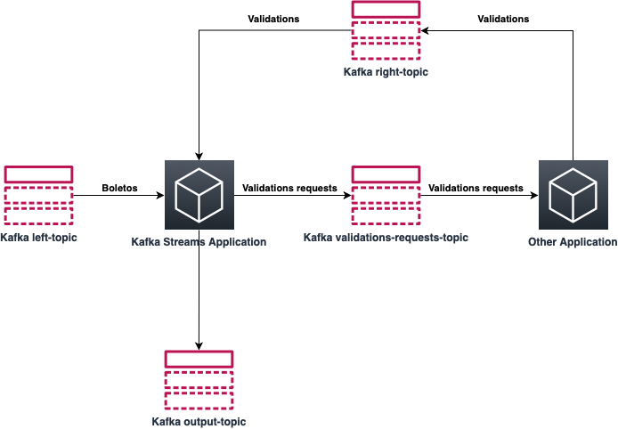
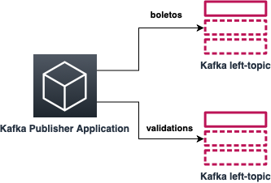
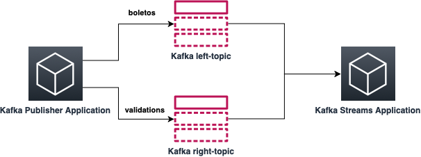
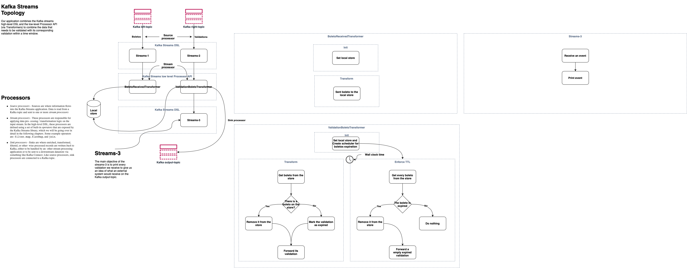
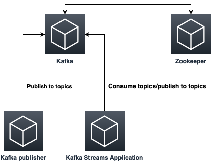

# Kafka-streams application demo

I developed this demo with the intent to demonstrate some features of the Kafka streams library. Therefore, I divided this demo into three core parts: A Kafka publisher, a Kafka streams application, and Kafka itself, along with Zookeeper.

## The demonstration

### Common definitions:
    "Boleto Bancário", simply referred to as Boleto (English: Ticket) is a payment method in Brazil regulated by FEBRABAN, short for Brazilian Federation of Banks.

The idea of this demonstration is to create a scenario where our first application receives a boleto to validate from a Kafka topic ("left-topic"), initiates some work, and forward this boleto to another application to complete the validation. The following application then replies with the boleto's validation on another Kafka topic ("right-topic"). Our first application consumes this other Kafka topic too.

There is an operational time window of 30 minutes to validate a boleto, and our first application is responsible for the validation response. So if it receives validation for a pending boleto in 30 minutes, we produce a result on another Kafka topic ("output-topic"), or in case of a validation timeout, we produce another result in the "output-topic" warning that the boleto couldn't be validated on time.

The application will make use of the Kafka Streams library to accomplish this workload. The Kafka streams application will create two different Kafka streams consuming from both Kafka topics mentioned above ("left-topic" and "right-topic")

For the Kafka stream consuming from the "left-topic", the application will start a stateful process keeping all the boletos pending validation on a local store. This Kafka stream also has an internal timeout mechanism that removes all boletos with pending validations for more than 30 minutes. For each of these expired boletos, we send an expired event for the boleto on the "output-topic". When the other Kafka stream consuming the "right-topic" receives a validation, our application verifies if its corresponding boleto is still waiting for its validation. If that's the case, we send a validation event for the boleto to the "output-topic" and remove it from the local store. If the first Kafka stream expired the boleto before its validation, we send a late validation event to the "output-topic" when the validation eventually arrives.

## Kafka Publisher

To accomplish our objectives we need to be able to create fake data for boletos and it respectives validations. The Kafka publisher application is responsible for generate this data to the Kafka streams application.

### ENV VARIABLES

    - BOOTSTRAP_SERVERS -> bootstrap servers is a comma-separated list of host and port pairs that are the addresses of the Kafka brokers in a "bootstrap" Kafka cluster that a Kafka client connects to initially to bootstrap itself.
    - LEFT_TOPIC -> The topic name used to publish boletos
    - RIGHT_TOPIC -> The topic name used to publish validations
    - CLIENT_ID_CONFIG_BOLETO -> An id string to pass to the server when making requests. The purpose of this is to be able to track the source of requests beyond just ip/port by allowing a logical application name to be included in server-side request logging. Used for the boleto producer.
    - CLIENT_ID_CONFIG_BOLETO_VALIDATION -> An id string to pass to the server when making requests. The purpose of this is to be able to track the source of requests beyond just ip/port by allowing a logical application name to be included in server-side request logging. Used for the validations producer.

## Kafka Streams Application

The Kafka Streams Application will be where we will implement all functionality described before. It will consume both topics and, within 30 minutes, produce a result on another Kafka topic.

### Kafka Streams Topology

Kafka Streams uses a programming paradigm called "dataflow programming" (DFP), a data-centric method of representing programs as a series of inputs, outputs, and processing stages. The stream processing logic in a Kafka Streams application is structured as a directed acyclic graph (DAG), where nodes (the rectangles in the diagram above) represent a processor. The edges (the lines connecting the processers) represent input and output streams (where data flows between them). Thus, a collection of processors forms a Processor Topology for the Kafka Streams Application.

### ENV VARIABLES

    - BOOTSTRAP_SERVERS -> bootstrap servers is a comma-separated list of host and port pairs that are the addresses of the Kafka brokers in a "bootstrap" Kafka cluster that a Kafka client connects to initially to bootstrap itself.
    - LEFT_TOPIC -> The topic name used to consume boletos (must be the same used in the Kafka Publisher)
    - RIGHT_TOPIC -> The topic name used to consume validations (must be the same used in the Kafka Publisher)
    - OUTPUT_TOPIC -> The topic name used to publish boleto validations results
    - STORE_NAME -> The name used for the local store
    - CLIENT_ID_CONFIG -> An id string to pass to the server when making requests. The purpose of this is to be able to track the source of requests beyond just ip/port by allowing a logical application name to be included in server-side request logging. Used for the Kafka Streams Application.
    - APPLICATION_ID_CONFIG -> Must be unique within the Kafka cluster as it is used as a namespace for the default client-id prefix, the group-id for membership management, and the prefix for internal topics (that Kafka Streams creates internally).
    - COMMIT_INTERVAL_MS_CONFIG -> How often StreamThread attempts to commit the position of processors and flush state stores

## Kafka and Zookeeper

Our Kafka publisher and Kafka Streams Application need a Kafka cluster and a Zookeeper to communicate.

## Pre-requisites
    - Docker
    - Docker-compose

## How to run
**You Don't need to set any ENV variable**

Create a new stack on the AWS CloudFormation service with the template on the aws folder.

Connect to the instance created by the AWS CloudFormation via SSH.

On the kafka-publisher folder:

    - Open a new terminal window
    - docker run --network=host kafka-publisher
    - docker run --network=host kafka-streams-app

Everytime you want to generate more data, you have to exec the last docker run command.